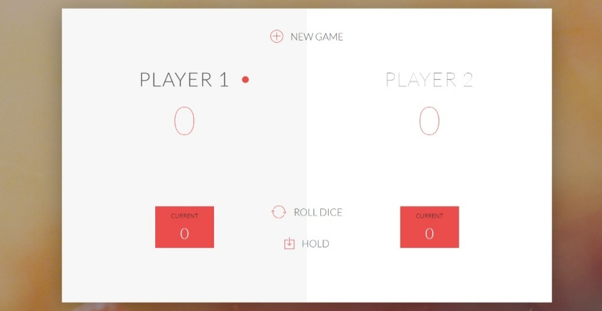

# Pig Game

## Welcome! 👋

Thanks for checking out my repository.

**To do this challenge, you need a basic understanding of HTML,CSS and DOM manipulation using Javascript.**

## All about this project

1. This game has 2 players each have there own turn.When they roll there dice the dice output will then be added to current section in bottom.
2. A player can roll the dice any no of times or can click hold button to transfer the chance to next player and get his current score to be transfered as permanant
3. The game starts with first player and the he can roll the dice any no of time till one appears.
4. In case of one appearing on dice the total score gets reset and the next player gets the chance.
5. Player that gets 100 first is the winner.

